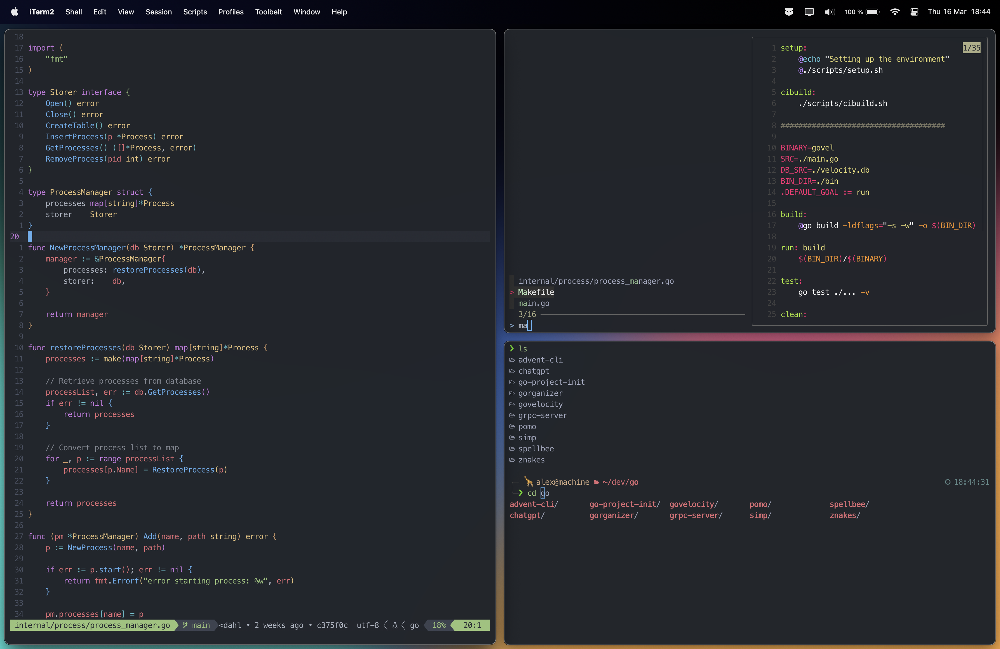

[](https://www.apple.com/macos)
[](https://neovim.io)
[](https://ohmyz.sh)
[](https://iterm2.com)
[](https://www.docker.com)
[](https://github.com/koekeishiya/yabai)
[](https://github.com/koekeishiya/skhd)
[](https://github.com/junegunn/fzf)
[](https://qmk.fm)
[](https://github.com/romkatv/powerlevel10k)

# My Dotfiles

This repository contains my personal dotfiles for setting up a new development environment.

## Installation

To install these dotfiles on a new machine, follow these steps:

1. Install [Homebrew](https://brew.sh/) if you haven't already:
```bash
/bin/bash -c "$(curl -fsSL https://raw.githubusercontent.com/Homebrew/install/HEAD/install.sh)"

```
2. Install [Oh My Zsh](https://ohmyz.sh/) framework:
```bash
sh -c "$(curl -fsSL https://raw.github.com/ohmyzsh/ohmyzsh/master/tools/install.sh)"

```
3. Install the dependencies listed in the `Brewfile`:
```bash
brew bundle
```
4. Install [vim-plug](https://github.com/junegunn/vim-plug)
```bash
sh -c 'curl -fLo "${XDG_DATA_HOME:-$HOME/.local/share}"/nvim/site/autoload/plug.vim --create-dirs \
       https://raw.githubusercontent.com/junegunn/vim-plug/master/plug.vim'
```
5. Create symbolic links for each file that you want to include in your dotfiles repository.
```bash
ln -s ~/.dotfiles/yabai/yabairc ~/.config/yabai/yabairc
ln -s ~/.dotfiles/skhd/skhdrc ~/.config/skhd/skhdrc
ln -s ~/.dotfiles/p10k/p10k.zsh ~/.p10.zsh
ln -s ~/.dotfiles/zsh/.zshrc ~/.zshrc
ln -s ~/.dotfiles/nvim/lua/ ~/.config/nvim/lua/
ln -s ~/.dotfiles/nvim/init.vim ~/.config/nvim/init.vim
```

Or run the script [symlinks.sh](https://github.com/AlexEkdahl/.dotfiles/blob/main/scripts/symlinks.sh)
```bash
./scripts/symlinks.sh
```

### Iterm

0. Unzip the fonts in `/fonts` and install.

1. Open iTerm2.
2. Go to "iTerm2" in the menu bar > "Preferences".
3. Click on the "General" tab.
4. Check the box that says "Load preferences from a custom folder or URL".
5. Click on the "Browse" button and navigate to the `iterm2` folder in this dotfiles repository.
7. Close and reopen iTerm2 to apply the new settings.


## Features
[](https://neovim.io/)

Here are some of the features that are included in this dotfiles repository:

- Customized `zsh` shell configuration with plugins like `zsh-autosuggestions` and `zsh-syntax-highlighting`
- Custom `git` configuration and aliases like `gamend` for git commit --amend with confirmation for protected branches and `grename` for renaming branches locally and remotely.
- Custom `fzf` configuration for fuzzy finding.
- Custom `docker` aliases for managing containers like `ds` for selecting a running container to stop and `dbash` for selecting a running container to enter shell.
- Custom `neovim` configuration and plugins including `onedark` theme, `lsp` and `treesitter` for language support, `telescope` for fuzzy finding, `spellbee` for spell checking, and more.
- Custom `yabai` and `skhd` configuration files for macOS window and shortcut management.
- Custom `iterm2` configuration files for terminal preferences.
- Custom `vscode` configuration files for keybindings and settings.
- Custom `p10k` configuration files for `powerlevel10k` theme.

- Additional files for keyboard firmware configuration and fonts.
